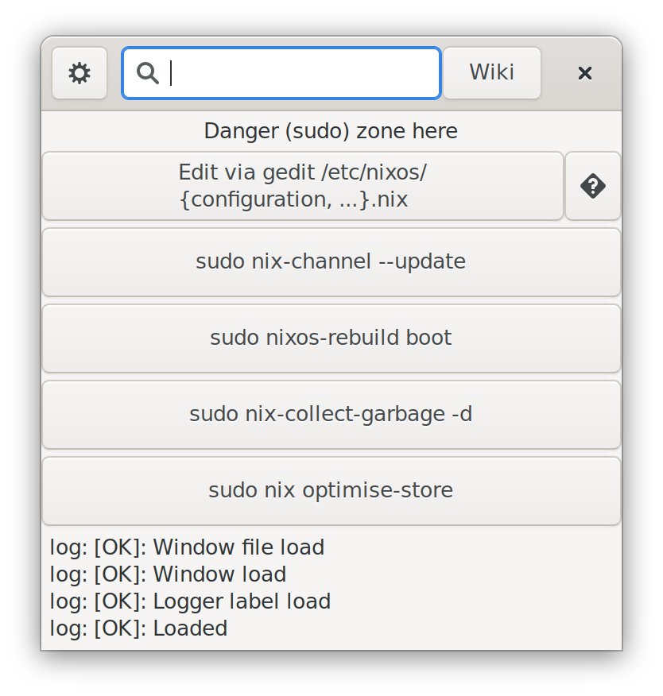
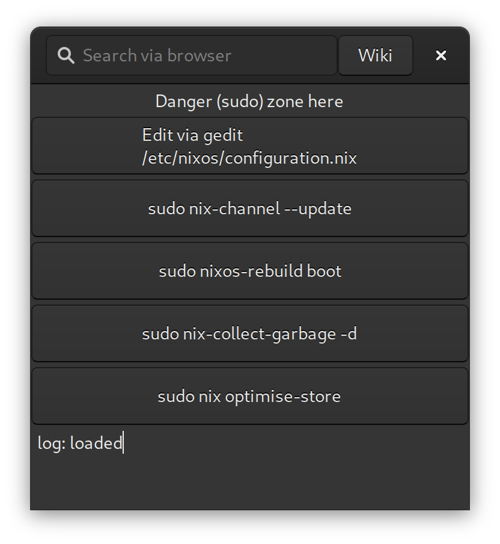

# Simple NixOS helper using Go & GTK3
### Provided:
- Search on
	- https://search.nixos.org/packages
	- https://nixos.wiki/
- gedit to open configuration.nix
- channels update
- rebuild to boot
- garbage collect
- store optimization

|  |  |
| ------------- | ------------- |
| Adwaita light | Adwaita dark |

### WIP:
- logs

### TODO:
- keyboard shortcuts
- GNOME extension

